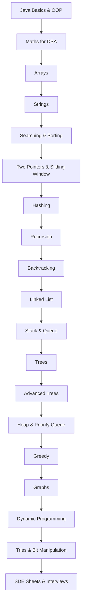

# 🚀 Java DSA Mastery — FAANG Preparation

<div align="center">
  
  
  
  
</div>

---

## 🔥 About This Repository

This repository is my **complete, structured, and long-term plan** to master **Data Structures & Algorithms using Java**, with a strong focus on **FAANG-level interview preparation**.

It is designed to be:

* 📚 **Beginner → Advanced friendly**
* 🧠 **Pattern-based & interview-oriented**
* 🗂️ **Extremely organized (topic + sheet + company wise)**
* ✨ **Clean, aesthetic, and GitHub-presentable**

---

## ✅ What This Repo Contains

* ✔️ Topic-wise DSA (Basics → Advanced)
* ✔️ Java-first approach (clean OOP-style code)
* ✔️ SDE Sheets (Apna College, CodeHelp, Take U Forward)
* ✔️ Company-wise interview questions
* ✔️ Notes + patterns + dry runs
* ✔️ Strict coding standards (production-style)

---

## 📂 Folder Structure (Final & Scalable)

```
📦 Learn-Data-Structure-And-Algorithm-In-Java
│
├── 🔢 Array/
├── 🧵 String/
├── 🔁 Two Pointer And Sliding Window/
├── 🔍 Binary Search/
├── 🔀 Sorting/
├── 🔧 Bit Manipulation/
├── 📚 Collection Framework/
├── ➗ Maths For DSA/
├── ♻️ Recursion/
├── 🧠 Recursion Advanced/
├── 🔙 Backtracking/
├── 🔗 LinkedList/
├── 🧰 Stack/
├── 🛤 Queue/
├── 🌲 Binary Tree/
├── 🌳 Binary Search Tree/
├── 🔡 Tries/
├── 🔼 Heap And Priority Queue/
├── ♟️ Greedy/
├── 🧭 Graph/
├── ⛓️ Hashing/
├── 🧩 Dynamic Programming/
│
├── 📝 SDE Sheet/
│   ├── Apna College/
│   ├── Code Help/
│   └── Take U Forward/
│
├── 🧪 Interview/
│   ├── Amazon/
│   ├── Google/
│   ├── Microsoft/
│   ├── Meta Facebook/
│   ├── Netflix/
│   ├── Uber/
│   ├── Adobe/
│   ├── LinkedIn/
│   ├── Oracle/
│   ├── Salesforce/
│   ├── Atlassian/
│   ├── Accenture/
│   ├── Postman/
│   └── Figma/
│
├── ☕ Java/
├── 🧱 Object Oriented Programming/
├── 📄 README.md
├── 🚫 .gitignore
└── ⚙️ .idea/
```

---

## 📊 Progress Tracker (Living Section)

### 🔵 Core Topics

* Arrays → **0 / 50**
* Strings → **0 / 50**
* Binary Search → **0 / 50**
* Sorting → **0 / 50**
* Two Pointers → **0 / 40**
* Sliding Window → **0 / 40**

### 🟣 Data Structures

* LinkedList → **0 / 60**
* Stack → **0 / 40**
* Queue → **0 / 40**
* Trees → **0 / 120**
* Tries → **0 / 40**
* Heap & Priority Queue → **0 / 50**
* Graph → **0 / 100**

### 🟠 Algorithms

* Recursion → **0 / 40**
* Backtracking → **0 / 60**
* Bit Manipulation → **0 / 40**
* Greedy → **0 / 50**
* Dynamic Programming → **0 / 150**

### 🟤 Java Essentials

* Java Basics → **0 / 30**
* OOP → **0 / 20**
* Collection Framework → **0 / 60**
* Maths for DSA → **0 / 30**

### 🔥 Interview Preparation

* Company-wise Questions → **0 / 300**
* SDE Sheets → **0 / 450**

---

## 🧭 DSA Learning Roadmap



---

## 📐 Coding Guidelines (Strict)

* 🟢 **One problem per file**
* 🟢 Class names → `PascalCase`
* 🟢 Variables & methods → `camelCase`
* 🟢 Add **Time & Space Complexity** at the top
* 🟢 No unnecessary boilerplate
* 🟢 Readable > Clever

Example header:

```
// Problem: Two Sum
// Time Complexity: O(n)
// Space Complexity: O(n)
```

---

## 🎯 Ultimate Goal

> Crack **FAANG / MAANG / Product-Based Company** interviews with:

* Strong fundamentals
* Clean Java code
* Pattern recognition
* Confidence ✨

---

## 📜 License

Licensed under **Apache License 2.0**.

---

🔥 *This repository will keep evolving as I grow.*
